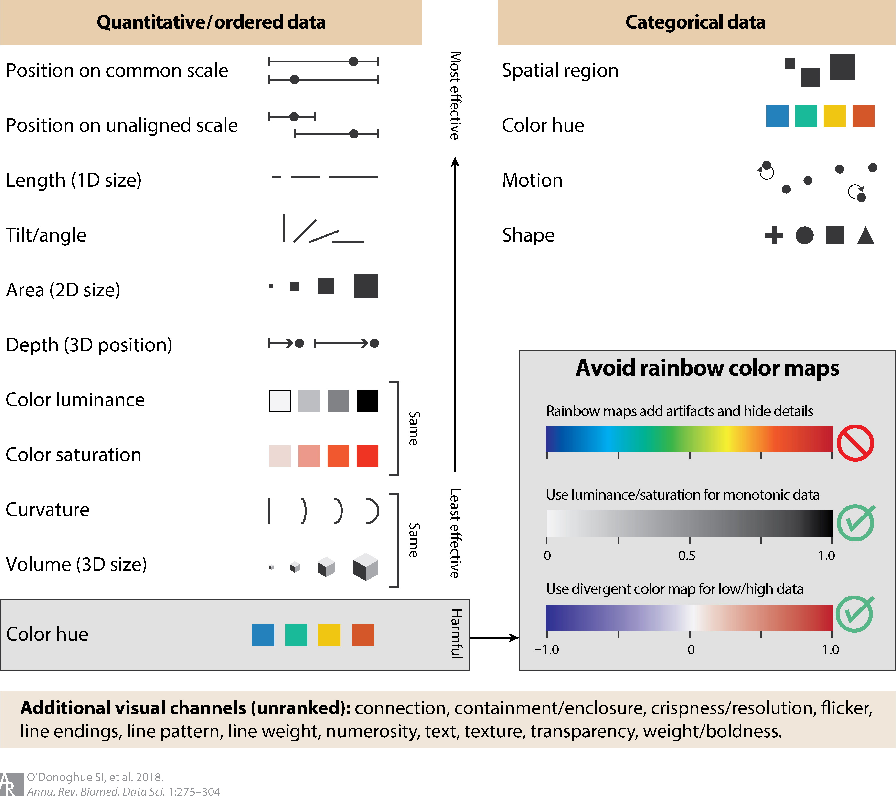
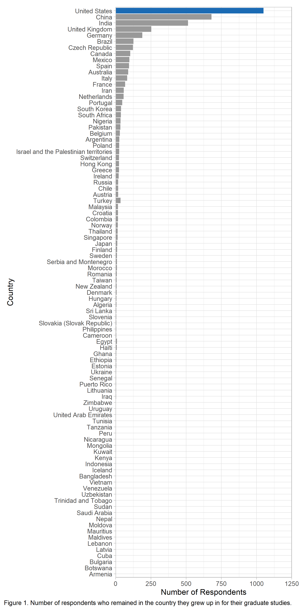

```{r setup, include=FALSE}
knitr::opts_chunk$set(echo = TRUE)
```

## Brief Introduction to R and RStudio
The term "R" is used to refer to both the programming language and the software that interprets the scripts written using it.

RStudio is currently a very popular way to not only write your R scripts but also to interact with the R software. To function correctly, RStudio needs R and therefore both need to be installed on your computer.

To make it easier to interact with R, we will use RStudio. RStudio is the most popular IDE (Integrated Development Interface) for R. An IDE is a piece of software that provides tools to make programming easier.

Reasons to use R:

* Easy to reproduce (less pointing and clicking)
* Able to analyze data and create visualizations without altering the data we input into our script regardless of the analysis we run
* Analysis and visualization possibilities are limitless and cross disciplinary boundaries
* Works on all types and sizes of data
* Open source
* Large and welcoming community

## Create a new project
* Under the File menu > New Project > Existing directory > *Browse for the folder where you saved the data* > Create project (This is now our working directory)
* It's good practice to keep all related data, analysis, and text in the same folder in order to use relative paths as opposed to the full path to the file's location. Another best practice is to create a separate folders for your data, data outputs, and figure outputs. So let's create a folder named data in our working directory and put the data into it and create an empty data_output folder and an empty fig_output folder.
* Create a new file where we will type our scripts. Go to File > New File > R script OR click the plus sign hovering over the white rectangle in the toolbar. Click the save icon on your tooolbar, or, in the menu, File > Save As and save your script as "DataViz-R-class-202208.R"

Start by giving our document a title using a comment which are denoted by a #
```{r eval=FALSE}
#Introduction to Data Visualization with R and ggplot2
#Instructor: Tess Grynoch
#Notes by Name

#Comments allow you to add notes as you write your code
```
Notice how after we start making changes the file name in the tab turns red and has an * beside it. It's a reminder that we have not saved the new changes to the document yet. As we go along, remember to hit the save icon or control + s (On PC) or command + s (On Mac).  

### Install packages and add libraries
To expand on what is already available through RStudio, we need to install packages. Today we'll be using tidyverse which is a collection of R packages for data science including ggplot2. For more information on the packages, visit the [tidyverse website](https://www.tidyverse.org/). 
```{r eval=FALSE}
install.packages("tidyverse")
```
Once we install the package, we need to tell it which libraries we will be using
```{r}
library(tidyverse)
```
### Process of creating a data visualization
1. Identify your question/goal
2. Identify the audience for your results
3. Collect and analyze data needed
4. Choose appropriate visualization(s) to meet the needs of your question, audience, and data (sketch it out)
5. Apply good design concepts
6. Edit as necessary 

For today the first three steps have been completed already and we're ready to move onto step 4.
### The research question
Based on the 2019 Nature PhD Students Survey, Which country has the most respondents who are studying in the same country they grew up in?

The [original data and full text of the survey](https://figshare.com/s/74a5ea79d76ad66a8af8?file=18543278) is available on Figshare. We will be using a version that has been modified to more easily create the charts for this class. 

### Reading files into R
To use data in R and RStudio we must first read it into the environment and assign it a variable name.
```{r}
phdsurvey <- read.csv("data/Nature_PhDsurvey_Anon_v2")
```
I've used the relative path to the file above but if I were to use the full destination name it would look something like "C://Users/grynochc/Desktop/DataVizR-202208/data/Nature_PhDsurvey_Anon_v2.csv"
&nbsp;
You can read other files into R using similar functions such as: 
```{r eval=FALSE}
#Excel files
library(readxl)
read_xlsx

#SAS, SPSS, STATA files
library(haven)
read_sas() 
read_spss()
read_stata()
```
### Choosing a chart type
Resources:


* [Andrew Abela's Chart Chooser](https://extremepresentation.typepad.com/files/choosing-a-good-chart-09.pdf)
* [Juice Analytics Chart Chooser](http://labs.juiceanalytics.com/chartchooser/index.html)
* [Data Visualization Catalogue](https://datavizcatalogue.com/)
* [Stephanie Evergreen's Qualitative Chart Chooser](http://stephanieevergreen.com/wp-content/uploads/2017/11/Qualitative-Chooser-3.pdf)


Important to keep in mind that some visual channels are more effective than others
{width=50%}


Copyright © 2018 Seán I. O'Donoghue et al. This work is licensed under a CC-BY 4.0 International License


**Based on our research question and the data available? What type of chart should we create?**

### Creating charts in R with ggplot2
ggplot2 comes as part of tidyverse and can be used to create a number of different plots. Today we'll cover a couple of basic ones, bar charts and dot plots, but the premise behind building a chart in ggplot is the same for all charts.


There are many resources for creating charts in ggplot2. However, the one referred to most often in today's class is the [Data visualization with ggplot2 cheat sheet (download link)](https://raw.githubusercontent.com/rstudio/cheatsheets/main/data-visualization.pdf). The cheat sheet can also be useful when deciding what type of chart you want to create.


With any ggplot chart, you start with what data you will be using.Since I'm only interested in the students who are studying in the countries they grew up in, I'll need to apply a filter. 
```{r}
homephd <- filter(phdsurvey, homestudy == "Yes")

ggplot(data = homephd)
```


Next, we'll define our plot area (mapping) using the aesthetic (aes) function. This generates a blank plot. 
```{r}
ggplot(data = homephd, mapping=aes(x=country, y = Total))
```


We add the various elements to the chart as geoms with a + symbol on the previous line which will automatically indent the next line to keep all our code in a block to run together.
```{r}
ggplot(data = homephd, mapping=aes(x=country, y = Total)) +
  geom_col()
```

We now have a basic bar chart but there are a number of chart improvements we can make to better communicate our story.

Since R has such infinite variety of features for charts and there is usually more than one way to accomplish a task, I find it useful to create a plot wish list for all the improvements I want to accomplish with a chart. This is also useful if you are new to R and need to look up how to make the changes.

**Plot wish list**


* Reorder chart
* Change the theme of the chart (background, axes, etc.)
* Change the color of the bars 
* Highlight the United States
* Add title
* Change axes titles
* Adjust the y-axis to start at 0


By default, ggplot2 will order bars based on factors in the x axis. To get our chart to order the bars based on the number of respondents we need to tell it how to sort the data.
```{r}
homephd <- homephd %>% 
  mutate(country = fct_reorder(country, Total))

#run chart again
ggplot(data = homephd, mapping=aes(x=country, y = Total)) +
  geom_col() #now ordered!
```


### Theme
The theme of your chart dictates the overall look of your chart and are preset combinations of backgrounds, axes formats, and gridline formats. A shortlist of formats is located on the second page of the ggplot2 cheatsheet. I'm a fan of the light theme so that's what I'm going to use.
```{r}
ggplot(data = homephd, mapping=aes(x=country, y = Total)) +
  geom_col()+
  theme_light()
```


### Color
To change the color of our bars we are going to use the fill aesthetic within geom_col. There is also a color aesthetic and it dictates the outline of the bars.


The fill aesthetic will accept a variable name if you want the colors to be based on a category (ex. Genre), there is also a limited number of color names that can be used ("red", "green", "blue", etc.), but if there is a specific color that you want to use, I recommend using hexidecimal color codes. My preferred site for finding hexadecimal color codes is [color-hex.com](https://color-hex.com) but there are many other options.


There are many places to pull inspiration for chart colors:


* From an image using an image color picker
* Using copy-tested color gradients such as [ColorBrewer2](http://colorbrewer2.org/), which is built into ggplot2, or [CartoColor](http://carto.com/carto-colors/)
* Using a single color or group of colors as inspiration to create a palette using such tools as [Chroma.js Color Palette Helper](http://vis4.net/palettes/) or [Colorpicker for data](http://tristen.ca/hcl-picker/)


Points to keep in mind when choosing colors:


* Limit colors when possible
* Label directly
* Ensure strong contrast with background (involves knowing where your image will appear)
* Use color strategically to highlight or group
* Keep in mind that colors have meanings that change across cultures
* Use predefined color meanings (eg. water is blue)
* Sequential color scales should only be used on quantitative data or ordered qualitative data
* Diverging colors scales should only be used where there is a meaningful middle point
```{r}
ggplot(data = homephd, mapping=aes(x=country, y = Total)) +
  geom_col(fill="#999999")+
  theme_light()
```


Check out what other aesthetics are available in geom_col
```{r eval = FALSE}
?geom_col
```
We can also highlight one row by adding another geom_col and filter for United States.
```{r}
ggplot(data = homephd, mapping=aes(x=country, y = Total)) +
  geom_col(fill="#999999")+
  theme_light()+
  geom_col(data = filter(homephd, country == "United States"), fill="#1b6bb4")
```

### Text
Best practices for text in charts:


* Keep text horizontal as much as possible
* Annotate figures directly to highlight key points in a chart
* Use descriptive titles


Adding title and axes using labs and formatting using theme(axis.text.x, plot.title)
```{r}
ggplot(data = homephd, mapping=aes(x=country, y = Total)) +
  geom_col(fill="#999999")+
  theme_light()+
  geom_col(data = filter(homephd, country == "United States"), fill="#1b6bb4")+
  labs(x = "Country", y= "Number of Respondents", caption= "Figure 1. Number of respondents who remained in the country they grew up in for their graduate studies.")
```

All the names for the countries are overlapping at the bottom of the chart and since there are so many of them, it'll make them easier to read if we flip the x and y axes. We accomplish this with the coord_flip() function.
```{r}
ggplot(data = homephd, mapping=aes(x=country, y = Total)) +
  geom_col(fill="#999999")+
  theme_light()+
  geom_col(data = filter(homephd, country == "United States"), fill="#1b6bb4")+
  labs(x = "Country", y= "Number of Respondents", caption= "Figure 1. Number of respondents who remained in the country they grew up in for their graduate studies.")+
  coord_flip()
```

To adjust the axis so it starts at 0, we're going to use the scale function. It also cutting off a 0 in our last label of our Number of Respondents axis so we'll need to adjust the margin of the theme. 
```{r}
ggplot(data = homephd, mapping=aes(x=country, y = Total)) +
  geom_col(fill="#999999")+
  theme_light()+
  geom_col(data = filter(homephd, country == "United States"), fill="#1b6bb4")+
  labs(x = "Country", y= "Number of Respondents", caption= "Figure 1. Number of respondents who remained in the country they grew up in for their graduate studies.")+
  scale_y_continuous(expand = c(0,0), limits= c(0, 1250))+
  coord_flip()+
  theme(plot.margin = margin(10,20,10,10))
```


You can also use the theme to style the text using element_text. Find out what you can change with element_text
```{r eval = FALSE}
?element_text
```

Congratulations on completing the plot wish list! 

To export our final chart and share it with the world, we'll first assign our chart a name then use ggsave to export. With ggsave you can also specify width, height, and units. 
```{r}
homephdplot <- ggplot(data = homephd, mapping=aes(x=country, y = Total)) +
  geom_col(fill="#999999")+
  theme_light()+
  geom_col(data = filter(homephd, country == "United States"), fill="#1b6bb4")+
  labs(x = "Country", y= "Number of Respondents", caption= "Figure 1. Number of respondents who remained in the country they grew up in for their graduate studies.")+
  scale_y_continuous(expand = c(0,0), limits= c(0, 1250))+
  coord_flip()+
  theme(plot.margin = margin(10,20,10,10))
  
homephdplot
```
```{r eval=FALSE}
#Export chart
ggsave("./charts/HomePhDPlot.png", homephdplot, width = 6, height = 12, units = "in")
```



### Data Citation
If you are using someone else’s data, cite it! 


If you published the full dataset, cite it!


* Helps readers find the original data source
* Increases the legitimacy of your chart


Copy the citation suggested where you got the data or use your preferred citation style.


Primary components:


* Author/ Creator (Individual, group, or organization)
* Title
* Year of Publication
* Publisher (often the repository where the data is housed)
* Version or edition
* Access Information (URL, DOI, or another persistent identifier)


General format:


Author (Year). Title with version. Publisher. Access information. 

&nbsp;
&nbsp;
&nbsp; 
Citation for this dataset:

Nature. (2019). 2019 Nature PhD Students Survey Data(Version1). figshare. https://doi.org/10.6084/m9.figshare.10266299.v1 

### Visualizing responsibly
Was this visualization created responsibly? What could make this visualization better?

* We didn't distort the data (check)
* We answered our research question (check)
* Is there additional context that could be added for our audience to better understand the data? (yes)

What type of contextual data could we add?
Number of respondents from each country
```{r}
#Apply the same ordering of countries from homephd to phdsurvey
phdsurvey <- phdsurvey%>% 
  mutate(country = fct_reorder(country, Total))

ggplot(data = homephd, mapping=aes(x=country, y = Total)) +
  geom_col(data = phdsurvey, fill = "#c1c1c1")+ #we need to add it as a layer early in the chart since we want it to show up behind
  geom_col(fill="#999999")+
  theme_light()+
  geom_col(data = filter(homephd, country == "United States"), fill="#1b6bb4")+
  labs(x = "Country", y= "Number of Respondents", caption= "Figure 1. Number of respondents who remained in the country they grew up in for their graduate studies.")+
  scale_y_continuous(expand = c(0,0), limits= c(0, 1600))+ #need to adjust the limit to the highest number
  coord_flip()+
  theme(plot.margin = margin(10,20,10,10))
```


We could also have used ratio of respondents from that country or looked outside the dataset and found data on how many PhD students are studying in each country which would help provide a better understanding and context for the outcomes of this survey. 

## Further resources for learning R
* [R for Data Science](https://r4ds.had.co.nz/) by Hadley Wickham & Garrett Grolemund
* [UMass Chan Bootstrappers R Course](https://bootstrappers.umassmed.edu/bootstrappers-courses/courses/rCourse/index.html) by Nick Hathaway
* [Software Carpentry Lessons](https://software-carpentry.org/lessons/)
* [Data Carpentry Lessons](https://datacarpentry.org/lessons/)
* [Sage Research Methods R Tutorials](https://library.umassmed.edu/node/97). Search for R statistical package and filter by the video content type

## Further data visualization resources
[Lamar Soutter Library Data Visualization Resource Guide](https://libraryguides.umassmed.edu/data-viz)

&nbsp;  
Materials from a number of different sources were used in the creation of this class including:

* The Carpentries' (previously Data Carpentry's) R for Social Scientists used under the CC-BY 4.0 license.  
* The Carpentries' (previously Software Carpentry) Programming with R used under the CC-BY 4.0 license.
* The Carpentries' (previously Software Carpentry) R for Reproducible Scientific Analysis used under the the CC-BY 4.0 license.
* R Course by Nick Hathaway as part of the UMMS Bootstrappers Courses
* [Visualizing the Future Data Visualization 101 module](https://visualizingthefuture.github.io/data-viz-101/)
&nbsp;
&nbsp;
&nbsp;  
 &nbsp; This work is licensed under a [Creative Commons Attribution 4.0 International License](http://creativecommons.org/licenses/by/4.0/) by Tess Grynoch


